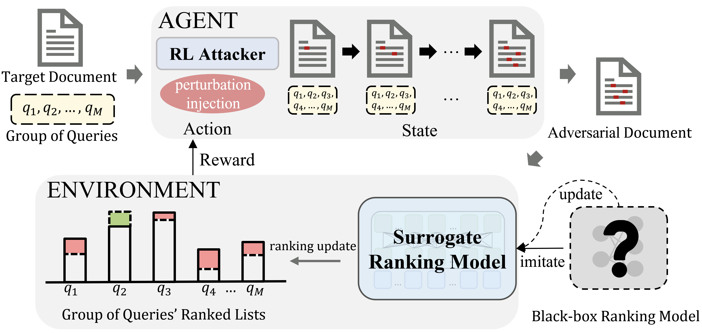

# TARA
This is the source code for paper "[Topic-oriented Adversarial Attacks against Black-box Neural Ranking Models](https://dl.acm.org/doi/10.1145/3539618.3591777)".

## Introduction


Neural ranking models (NRMs) have attracted considerable attention in information retrieval. Unfortunately, NRMs may inherit the adversarial vulnerabilities of general neural networks, which might be leveraged by black-hat search engine optimization practitioners. Recently, adversarial attacks against NRMs have been explored in the paired attack setting, generating an adversarial perturbation to a target document for a specific query. 

In this paper, we focus on a more general type of perturbation and introduce the topic-oriented adversarial ranking attack task against NRMs, which aims to find an imperceptible perturbation that can promote a target document in ranking for a group of queries with the same topic. We define both static and dynamic settings for the task and focus on decision-based black-box attacks. We propose a novel framework to improve topic-oriented attack performance based on a surrogate ranking model. The attack problem is formalized as a Markov decision process (MDP) and addressed using reinforcement learning. Specifically, a topic-oriented reward function guides the policy to find a successful adversarial example that can be promoted in rankings to as many queries as possible in a group. Experimental results demonstrate that the proposed framework can significantly outperform existing attack strategies, and we conclude by re-iterating that there exist potential risks for applying NRMs in the real world.

## License

This project is under Apache License 2.0.

## Citation

If you find our work useful, please consider citing our paper:
```
@inproceedings{liu2023topic,
author = {Liu, Yu-An and Zhang, Ruqing and Guo, Jiafeng and de Rijke, Maarten and Chen, Wei and Fan, Yixing and Cheng, Xueqi},
title = {Topic-Oriented Adversarial Attacks against Black-Box Neural Ranking Models},
year = {2023},
booktitle = {Proceedings of the 46th {International} {ACM} {SIGIR} {Conference} on {Research} and {Development} in {Information} {Retrieval}},
pages = {1700–1709},
volume = {},
}
```
